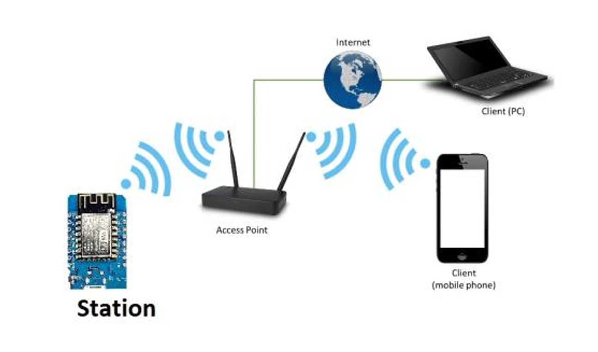

# LED Control with ESP32-CAM

## Overview
This project involves controlling an LED connected to an ESP32-CAM module. You can manage the LED's on and off durations via the internet and optionally receive commands through Telegram.

<br>

## Table of Contents
- [Project Objective](#Project-Objective)
- [Project 1: Web Control](#project-1-web-control)
- [Project 2: Telegram Commands](#project-2-telegram-commands)
- [Installation and Setup](#installation-and-setup)
- [Usage](#usage)
- [Examples](#examples)
- [Contributing](#contributing)
- [License](#license)


<br>

## 1 Project Objective

In this project, we aim to set up a web server on a Wi-Fi module so that users can connect to the module both locally and remotely (via the internet) to control an LED on the board. The project utilizes the Station mode, assuming that the Wi-Fi module will be connected to an ADSL modem.


## 2 Station Mode Operation

In this operational mode, the module functions as a Station (STA) and connects to an access point, allowing other devices to communicate with the Wi-Fi module through that access point. Figure 1 illustrates how to connect to the Wi-Fi module in Station mode.

<br>


Figure 1: Wi-Fi Module Operation in Station Mode

<br>

### 2.1 Accessing the Module via the Internet

There are two main methods for remote access to the module:

<br>

**2.1.1 Direct Access Using a Valid IP**

The ADSL modem through which you connect to the internet has a valid IP that identifies it on the internet network. However, since this IP is dynamic and allocated by your ISP, it cannot be used for a long time. To address this issue, there are two solutions:

- **Solution 1:** Obtain a static IP (In this solution, by paying an annual fee to the ISP, you can request that the IP allocated to you does not change.)
- **Solution 2:** Use Dynamic DNS. Assign a symbolic name to your modem and have a program on your computer periodically send the allocated IP address to the DNS server to update its records.

<br>

**2.1.2 Indirect Access**

In this method, you can connect to the module indirectly using an intermediary server. Instead of entering the module's IP address, the user enters the server's address, which forwards the information to the module. The Wi-Fi module periodically accesses the server to retrieve the latest registered information. There are two solutions for this:

- **Solution 1:** Use services like ngrok, which provide a ready-made server for this purpose, eliminating the need for server-side programming. It assigns you a subdomain, and by entering this subdomain in your browser, you connect to the module while the intermediary server remains hidden.
- **Solution 2:** Set up your own server to perform this operation.

<br>

------

<br>


## Project 1: Web Control
Modify three programs to control the LED's on and off durations via the internet.

Use the following HTML code as a guide for the web interface:

```html
<html>
<form action="" method="get" class="form-example">
  <label for="ON">Time(ms) on: </label>
  <input type="text" name="On" id="On" required><br><br>
  <label for="OFF">Time(ms) off: </label>
  <input type="text" name="off" id="off" required><br><br>
  <input type="submit" value="Send">
</form>
</html>
```

The result of running this code in a browser will allow users to input the on and off times for the LED.

<br>

## Project 2: Telegram Commands
Add functionality to receive commands via Telegram to control the LED.

<br>


## Installation and Setup
Follow these steps to set up and run the project:

1. Clone the repository:
   ```sh
   git clone https://github.com/AliBokaei/iot-esp32-cam.git
   cd led-control-esp32-cam
   ```

2. Install any necessary dependencies.

3. Upload the provided code to your ESP32-CAM module.

<br>

## Usage
1. Access the web interface using the ESP32-CAM's IP address.
2. Enter the desired on and off times for the LED and submit the form.


<br>

## Examples
Here’s an example of how to use the web interface to control the LED:

1. Enter `500` in the "Time(ms) on" field.
2. Enter `1000` in the "Time(ms) off" field.
3. Click "Send" to apply the settings.

<br>

## Contributing
Contributions are welcome! To contribute:

1. Fork the repository.
2. Create a new branch for your changes.
3. Submit a pull request with a description of your changes.

<br>

## License
This project is licensed under the MIT License. See the [LICENSE](LICENSE) file for details.
